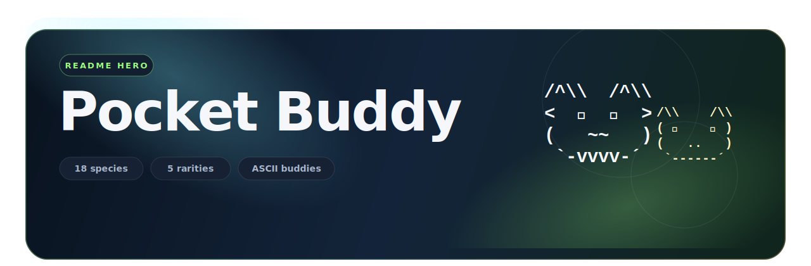

<p align="center">
  
</p>

# Pocket Buddy

> Customise your Claude Code `/buddy` with a faster picker, cleaner CLI, and one-command setup.

Pocket Buddy is a terminal tool for finding and applying the Claude Code buddy you actually want. Pick species, rarity, eyes, hat, and shiny traits, then write the result straight into your local Claude config.

Website:

[https://kaiknower.github.io/pocket-buddy/](https://kaiknower.github.io/pocket-buddy/)

## Buddy Preview

### Buddy Styles

Pocket Buddy can search for a specific look, then let Claude Code generate the soul around it.

| Style | Preview |
|---|---|
| Classic | `🦆 ★ common` |
| Rare | `🐢 ★★★ rare` |
| Epic | `🦉 ★★★★ epic` |
| Legendary | `🐉 ★★★★★ legendary` |
| Shiny | `🐈 ★★★★★ legendary ✨` |

Every applied buddy keeps its visual traits, while Claude Code can automatically generate its name and personality on first `/buddy`.

### Species

> `🦆 Duck` `🪿 Goose` `🫧 Blob` `🐱 Cat` `🐉 Dragon` `🐙 Octopus`
>
> `🦉 Owl` `🐧 Penguin` `🐢 Turtle` `🐌 Snail` `👻 Ghost` `🦎 Axolotl`
>
> `🦫 Capybara` `🌵 Cactus` `🤖 Robot` `🐰 Rabbit` `🍄 Mushroom` `🐈 Chonk`

### Traits

| Type | Options |
|---|---|
| Eyes | `·` `✦` `×` `◉` `@` `°` |
| Hats | `👑 crown` `🎩 tophat` `🧢 propeller` `😇 halo` `🧙 wizard` `⛑ beanie` `🐤 tinyduck` |
| Finish | `✨ shiny` |
| Soul | `Auto-generated name` `Auto-generated personality` |

## What It Does

| Feature | Description |
|---|---|
| Random roll | Roll a buddy with Claude Code's original probability model |
| Targeted hunt | Search for a legal buddy matching chosen traits |
| Full override | Advanced mode for directly overriding buddy values |
| Buddy picker | Choose species, rarity, eyes, hat, and shiny preferences |
| Direct flow | Launch and start choosing immediately |
| English by default | Starts in English, switch to Chinese later in Settings |
| Web gallery | Opens an external buddy gallery page |
| Bun bootstrap | Launchers install Bun automatically if needed |
| Config apply | Writes the selected buddy into Claude Code config |
| Auto soul | Claude Code can generate the buddy name and personality automatically |

## One-Line Start

### macOS / Linux

```bash
curl -fsSL https://raw.githubusercontent.com/kaiknower/pocket-buddy/main/run.sh | bash
```

### Windows PowerShell

```powershell
irm https://raw.githubusercontent.com/kaiknower/pocket-buddy/main/run.ps1 | iex
```

## Package Run

```bash
npx pocket-buddy
npm install -g pocket-buddy
pocket-buddy
```

## Local Run

```bash
bun buddy-reroll.mjs
```

## Terminal Preview

```text
══════════════════════════════════════════
Pocket Buddy v2.2.3
Fast pet picking for Claude Code /buddy
══════════════════════════════════════════
Runtime: Bun ✓ | Hash: wyhash (native install)

══════════════════════════════════════════
Pet Scan
Target  dragon legendary shiny
══════════════════════════════════════════
[1] 🐉  dragon
[2] 🦉  owl
[3] 👻  ghost

╔════════════════════════════════════╗
║ Hatch Result                       ║
╚════════════════════════════════════╝
══════════════════════════════════════════════
🐉  DRAGON
★★★★★ legendary  ✨ SHINY
──────────────────────────────────────────────
Trait  Eyes ◉   Hat 🧙 wizard
Power
DEBUGGING  ████████████████████ 99
WISDOM     ████████████████░░░░ 81
──────────────────────────────────────────────
Seed   164030
══════════════════════════════════════════════
```

## CLI

```bash
pocket-buddy search -s dragon -r legendary --shiny
pocket-buddy check
pocket-buddy gallery
pocket-buddy lang
```

## Interactive Flow

```text
Launch
  -> Random roll
  -> Targeted hunt
  -> Tools
       -> Full override
  -> Apply / Search again / Tools / Exit
```

## Tools

- `Check current buddy`
- `Customise name and personality`
- `Patch cli.js override mode`
- `Open web gallery`
- `Self-test hash`
- `Settings -> Switch language`

## Package

```json
{
  "name": "pocket-buddy",
  "bin": {
    "pocket-buddy": "./buddy-reroll.mjs"
  }
}
```

## Repository

```text
https://github.com/kaiknower/pocket-buddy.git
```
